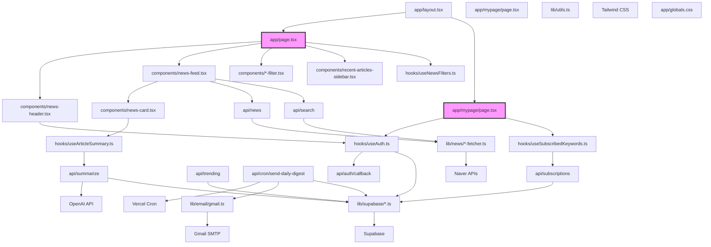

# 의존성 관계

## 📊 전체 의존성 다이어그램

**범례**:
- 🟪 페이지 (Routes)
- 🟦 UI 컴포넌트
- 🟩 커스텀 훅
- 🟨 라이브러리/유틸리티
- ⬜️ 외부 서비스/API

## 📦 주요 외부 라이브러리

### 프로덕션 의존성 (`dependencies`)

#### 핵심 프레임워크 & UI
- **next**: `15.2.4` - React 프레임워크 (App Router)
- **react**: `^19` - UI 라이브러리
- **react-dom**: `^19` - React DOM 렌더러
- **@tanstack/react-query**: `^5.90.5` - 서버 상태 관리, 캐싱, 데이터 동기화
- **tailwindcss**: `^4.1.9` - CSS 프레임워크
- **shadcn/ui (Radix UI)**: 다양한 `@radix-ui/*` 패키지들 - UI 컴포넌트 킷

#### 데이터 처리 & 유틸리티
- **fast-xml-parser**: `latest` - RSS 피드(XML) 파싱
- **cheerio**: `^1.1.2` - HTML 파싱 및 크롤링
- **date-fns**: `^4.1.0` - 날짜/시간 조작 및 포맷팅
- **zod**: `3.25.76` - 스키마 정의 및 유효성 검사
- **class-variance-authority**, **clsx**, **tailwind-merge**: 스타일 클래스 관리

#### AI & API
- **@ai-sdk/openai**: `2.0.52` - Vercel AI SDK용 OpenAI 어댑터
- **ai**: `5.0.76` - Vercel AI SDK (스트리밍, 훅 지원)

#### 데이터베이스
- **@supabase/supabase-js**: `^2.76.1` - Supabase 클라이언트 라이브러리
- **@supabase/ssr**: `^0.7.0` - 서버사이드 렌더링용 Supabase 헬퍼

#### 이메일
- **nodemailer**: `^7.0.10` - Node.js 이메일 발송 라이브러리

#### UI 컴포넌트 & 아이콘
- **lucide-react**: `^0.454.0` - 아이콘 라이브러리
- **sonner**: `^1.7.4` - 토스트 알림
- **react-resizable-panels**: `^2.1.7` - 리사이즈 가능한 패널
- **react-day-picker**: `^9.11.1` - 날짜 선택기

### 개발 의존성 (`devDependencies`)
- **typescript**: `^5` - TypeScript 컴파일러
- **@types/***:** 다양한 라이브러리의 타입 정의
- **postcss**, **autoprefixer**: CSS 후처리기
- **eslint**: 코드 린터

## 🔗 주요 의존성 흐름

### 1. 뉴스 데이터 흐름
`NewsAPI` (RSS + Naver) → `React Query` (캐싱) → `NewsFeed` → `NewsCard`

### 2. AI 요약 흐름
`NewsCard` (요약 요청) → `useArticleSummary` → `SummarizeAPI` → `OpenAI` & `Supabase` (캐싱)

### 3. 인증 흐름
`LoginModal` (로그인) → `Supabase Auth` (Google OAuth) → `useAuth` (세션 관리) → 전역 상태

### 4. 이메일 다이제스트 흐름
`Vercel Cron` → `CronDigestAPI` → `Supabase` (구독자/키워드 조회) → `NewsFetchers` → `OpenAI` (요약) → `Nodemailer` (Gmail SMTP 발송)

### 5. 상태 관리 흐름
- **서버 상태**: `React Query`가 API 데이터 캐싱, 동기화, 리페칭을 전담
- **UI 상태**: `useState`, `useReducer` (in custom hooks like `useNewsFilters`)
- **전역 상태**: `React Context`와 `useAuth` 훅을 통해 사용자 세션 정보 공유

## 💡 개선 제안 및 현재 상태

- **API 클라이언트 레이어**: `React Query`를 도입하여 API 호출 로직을 커스텀 훅(`useNews`, `useSummarize` 등)으로 분리하고 컴포넌트에서 격리했습니다. 이를 통해 코드 중복을 제거하고 재사용성을 높였습니다.
- **서버 상태 관리**: `React Query`를 사용하여 서버 데이터의 캐싱, 자동 리페칭, 로딩 및 에러 상태 관리를 중앙에서 처리합니다.
- **타입 정의**: `types/` 폴더에 API 응답 및 주요 데이터 모델의 타입을 중앙화하여 관리합니다.
- **의존성 정리**: `package.json`을 검토하여 불필요한 Radix UI 패키지를 일부 정리하고, 실제 사용하는 라이브러리 위주로 유지합니다.